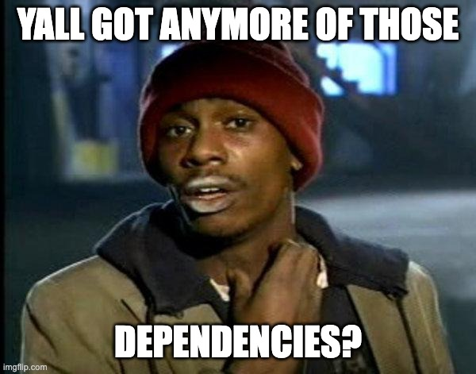
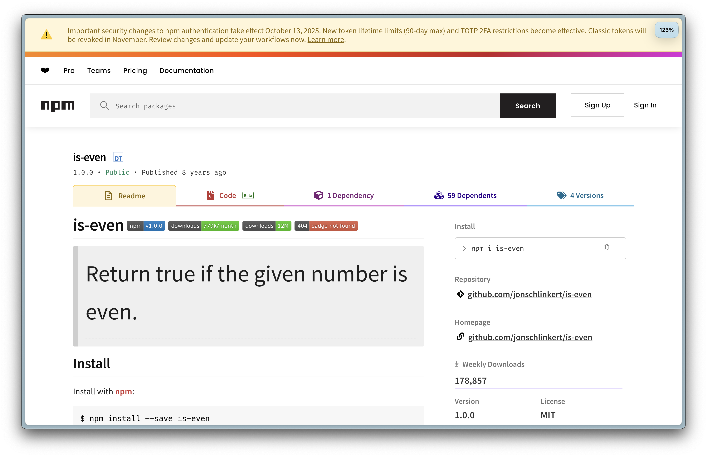
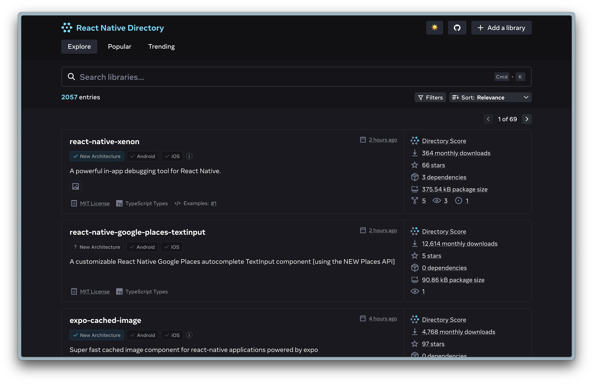
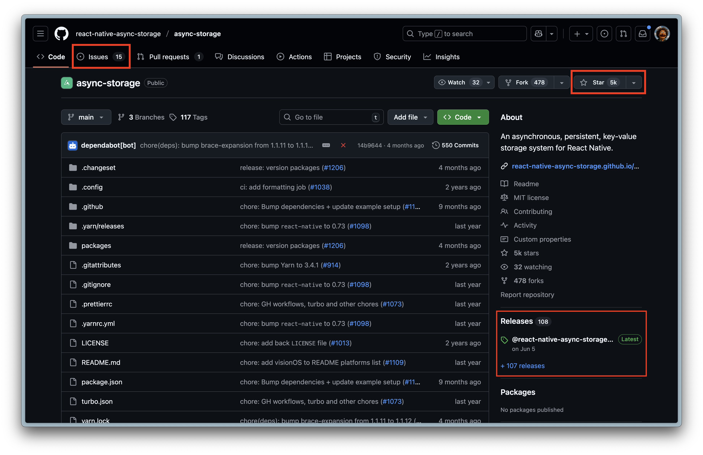

# Dependencies
## Making the right choice

---

## What to look for

- 🔨 **Validity check**: can I build it?
- ✅ **Compatibility check**: does it work?
- ❤️‍🩹 **Health check**: is it maintained?

🌲 [Excalidraw Decision Tree](https://link.excalidraw.com/readonly/B3qFAd2vdrdWVlKcQFHj?darkMode=true)

---

# 🔨 Validity check
https://github.com/i-voted-for-trump/is-even

---

# 🔨 Validity check

- Can (A)I build it?
- Does it solve the problem?
- Any mitigations? (performance loss, refactors required)

---

# ✅ Compatibility check

- [React Native Directory](https://reactnative.directory/)
- [Expo SDK](https://docs.expo.dev/versions/latest/sdk/)

---
# ✅ Compatibility check

- Version support?
- Any Github issues (Android/iOS)

---

# ❤️‍🩹 Health check

- https://github.com/markneh/react-native-esim
VS
- https://github.com/odemolliens/react-native-sim-cards-manager

---

# ❤️‍🩹 Health check

- Recent releases?
- Activity on Github issues?
- Rich contributions or stars?
- Documentation?
- Tests, passing CI/CD, etc.
- Secure? [Shai Hulud anyone?](https://www.stepsecurity.io/blog/ctrl-tinycolor-and-40-npm-packages-compromised)
