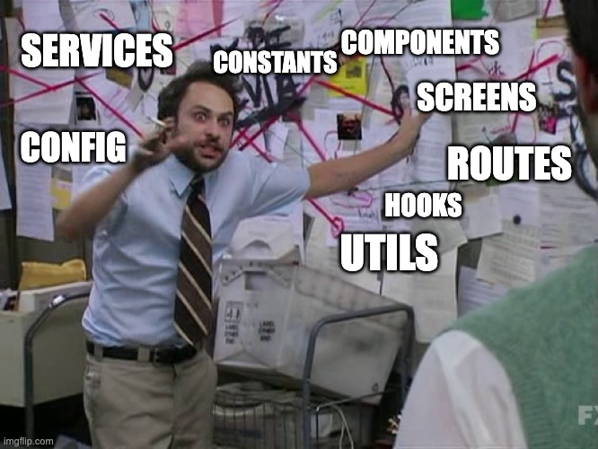
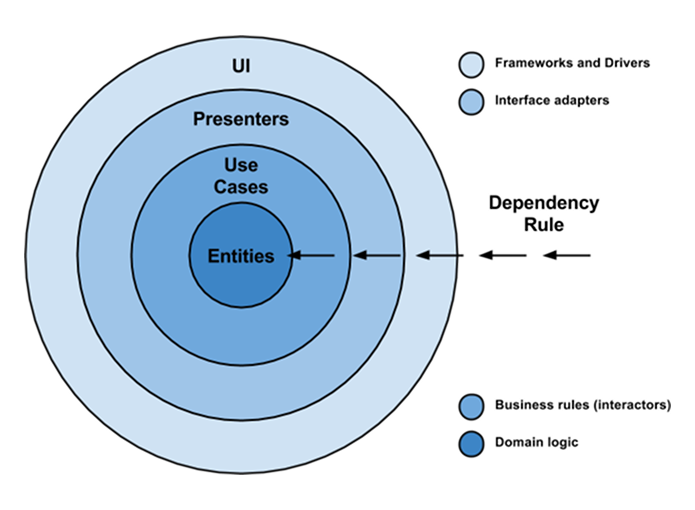
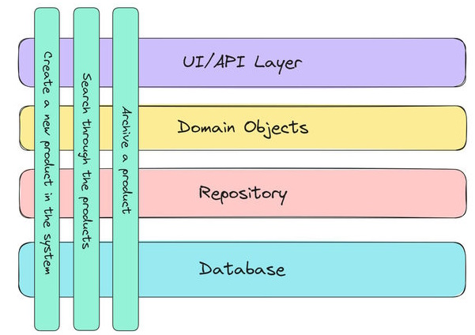
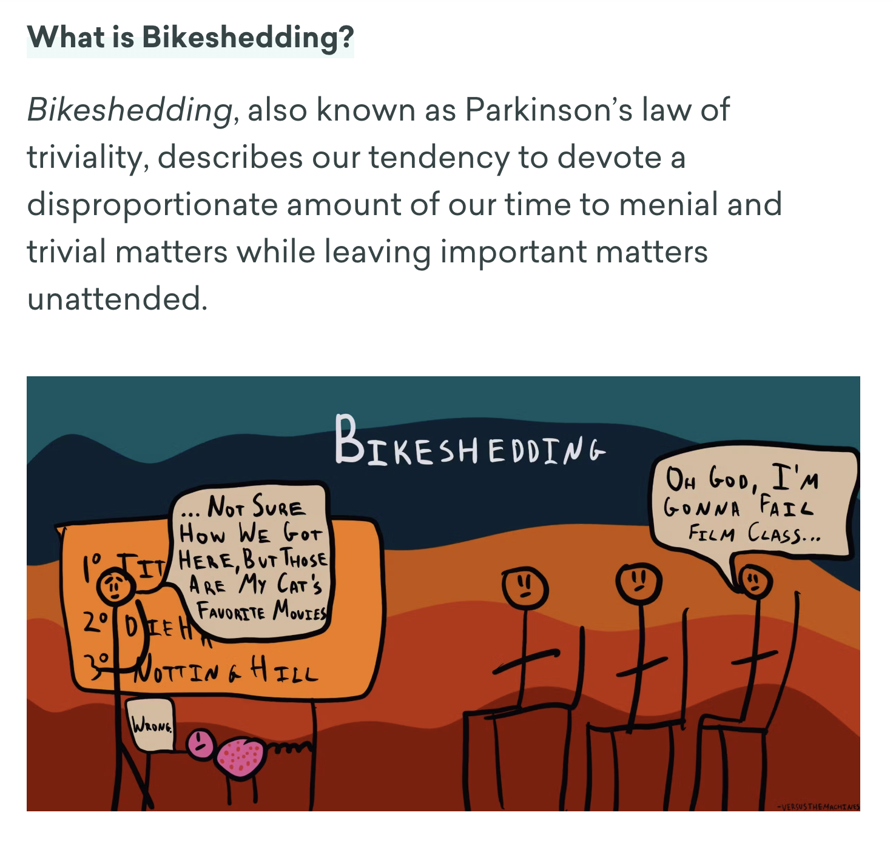
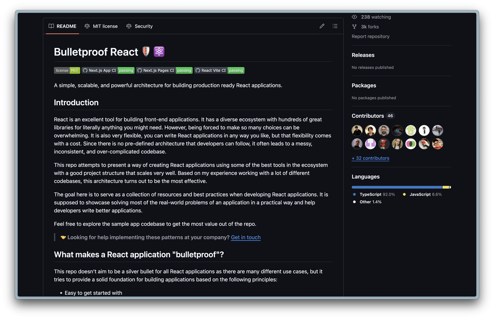

# Project Structure
## Scalability and maintainability



---

## Why is a Good Project Structure Important?

- 🧠 **Clarity:** Easy to understand
- 📈 **Scalability:** Handles growth smoothly
- 🧩 **Separation:** Modules stay independent
- ♻️ **Reusability:** Reuse components easily
- 🤝 **Collaboration:** Team works better
- 🚀 **Onboarding:** Quicker new hire ramp-up
- 📚 **Consistency:** Predictable, organized code


--- 

# Multiple approaches

- **Vertical slices**: Feature Based
- **Clean Code**: Technical Based

---

# Clean Code



- 🏗️ Independent of frameworks
- 🧪 Testable and maintainable
- 🏛️ Business rules in center
- 🧹 Clear separation of concerns

---

# Vertical slices



- 🗂️ Organize by feature
- 🧩 Independent, self-contained modules
- ⚡ Easy feature updates
- 🔗 Reduced inter-feature coupling

---

# Bike shedding
## Does it really matter?



---

> # "_Just pick one_" 🤷‍♀️
Levi, 2025

---

# Feature based example

[Bulletproof React](https://github.com/alan2207/bulletproof-react/blob/master/docs/project-structure.md)



---

```
src
|
+-- app               # application layer containing:
|   |                 # this folder might differ based on the meta framework used
|   +-- routes        # application routes / can also be pages
|   +-- app.tsx       # main application component
|   +-- provider.tsx  # application provider that wraps the entire application with different global providers - this might also differ based on meta framework used
|   +-- router.tsx    # application router configuration
+-- assets            # assets folder can contain all the static files such as images, fonts, etc.
|
+-- components        # shared components used across the entire application
|
+-- config            # global configurations, exported env variables etc.
|
+-- features          # feature based modules
|
+-- hooks             # shared hooks used across the entire application
|
+-- lib               # reusable libraries preconfigured for the application
|
+-- stores            # global state stores
|
+-- testing           # test utilities and mocks
|
+-- types             # shared types used across the application
|
+-- utils             # shared utility functions
```

---
```
src/features/awesome-feature
|
+-- api         # exported API request declarations and api hooks related to a specific feature
|
+-- assets      # assets folder can contain all the static files for a specific feature
|
+-- components  # components scoped to a specific feature
|
+-- hooks       # hooks scoped to a specific feature
|
+-- stores      # state stores for a specific feature
|
+-- types       # typescript types used within the feature
|
+-- utils       # utility functions for a specific feature
```