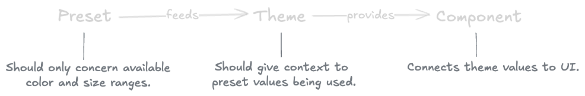

# Theming your React App

---

# Table of Contents

1. **Understanding Theme Architecture**
2. **How to define presets**
3. **How to define themes**
4. **Consuming themes in components**

---

# Understanding Theme Architecture
## Goals
- 🎯 High level of granularity
- 🧩 Components are agnostic
- 🚀 Scalable design (rebranding, user preferences, etc.)

---

---

# How to define presets
## Goals
- Separation of concerns
- Focus on range of values
- Provides a set to define themes

---

---

---

# Notes on presets

- Defines Fonts, font sizes, colors, effects, etc.
- Color scales (e.g. `{color}50`, `{color}100`, etc.)
- Text sizes (e.g. `textSm`, `textMd`, `textX2l`, etc.)
- Don’t use light, lighter, lightest or large, larger, largest you will get stuck (largesterst 💁‍♀️)

---

# How to define themes
## It is all about providing context

---
<!-- class: default -->

[_Source: https://medium.com/eightshapes-llc/naming-tokens-in-design-systems-9e86c7444676_
](https://medium.com/eightshapes-llc/naming-tokens-in-design-systems-9e86c7444676)

---
<!-- class: default -->

---
<!-- class: invert -->

# Notes on design tokens

- Provide context for the theme value.
- Ranges from basic to super granular:
    - `textInfo`
    - `textColorHeadingOnBrandFocused`

---

# Consuming themes in components

[Excalidraw diagram](https://link.excalidraw.com/readonly/7acA0ZMzjrApQ6diOEMX?darkMode=true)

