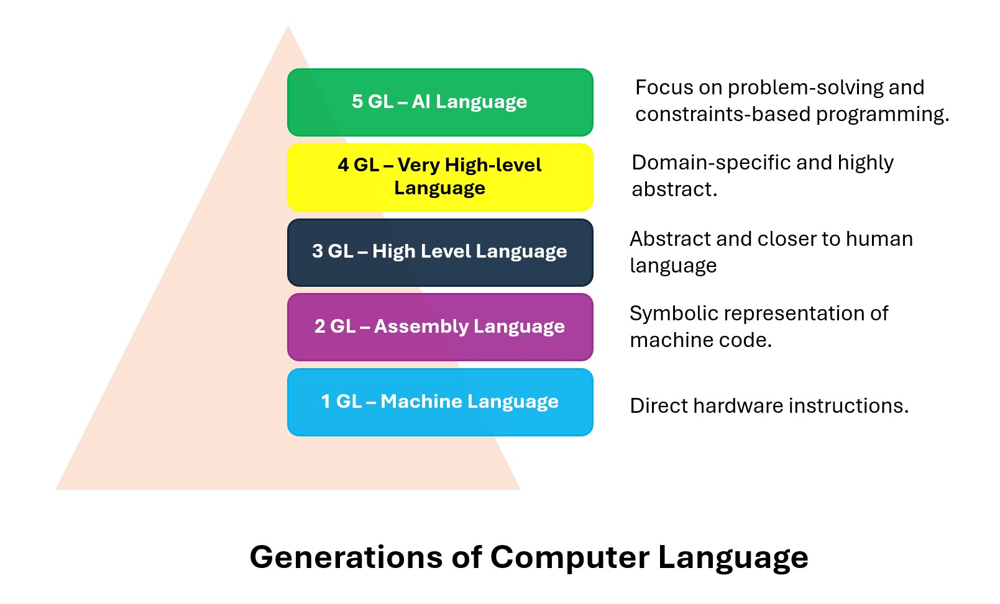
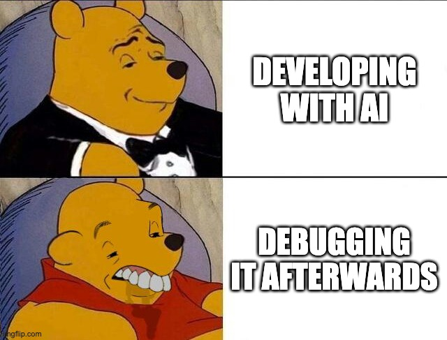

# Use of AI
## Disruptive or supporting?

---

# Poll
## How much are you using AI?

---

# Poll
## Which AI tools are you using?

---

# Poll
## Do you think AI will replace developers?

---

# My perspective on AI

> ## _"AI is just another abstraction"_
Levi (and others), 2025

---

---

> _How much implementation detail a programming language hides from developers, allowing focus on higher-level concepts_

[Measuring Abstraction Level of Programming Languages
](https://github.com/const/const-articles/blob/main/evolution/2025/01-measuring-language-level/MeasuringAbstractionLevelOfLanguages.adoc)

---

# Benefits

- **User friendly**: easy syntax.
- **Versatile**: being a 10x developer.
- **Accessible**: easy to learn and grow as a dev.

---

# Drawbacks

- **Error potential**: not all patterns are covered in training data.
- **Computational Complexity**: uses a lot of computational resources even for simple tasks.

---

# How I use AI

- **Agentic coding vs Tab coding**: Cursor
- **Validation & sanitization**: Unit tests & [KnipJS](https://knip.dev/overview/getting-started)
- **MCPs**: [Figma](https://www.framelink.ai/docs/quickstart)